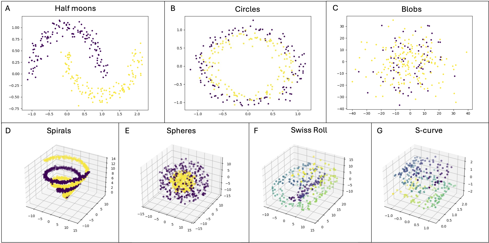
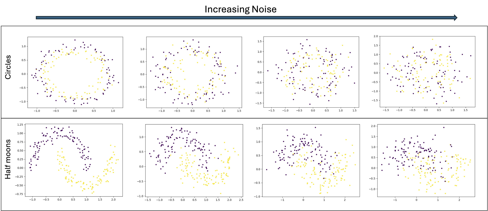

API Overview
============
Quick overview of the :ref:`methods` and :ref:`datasets` available in qbiocode.

.. _methods:

Methods
-------
Depending on the underlying foundations in qbiocode can be....

Embeddings
^^^^^^^^^^
Collection of common embeddings  (:mod:`qbiocode.embeddings`) functionalities.

.. autosummary::
    ~qbiocode.embeddings.embed.get_embeddings

Evaluation
^^^^^^^^^^
The :mod:`qbiocode.evaluation` submodule of qbiocode computes the evaluation metrics for the input dataset and the models.

Data Evaluation
""""""""""""""""
Depending on the underlying mathematical foundations, they can be classified into the following categories: (i)..

.. autosummary::
    ~qbiocode.evaluation.dataset_evaluation.evaluate

Model Evaluation
""""""""""""""""

.. autosummary::
    ~qbiocode.evaluation.model_evaluation.modeleval

Model Computation 
^^^^^^^^^^^^^^^^^
qbiocode brings together a number of established machine learning model both from classical and quantum (:mod:`qbiocode.learning`).
Multiple models can be run via the following 

.. autosummary::
    ~qbiocode.evaluation.model_run.model_run

Classical Models
""""""""""""""""

QBioCode provides classical machine learning models from `scikit-learn <https://scikit-learn.org/>`_ for baseline comparisons and benchmarking against quantum models.

.. autosummary::
    ~qbiocode.learning.compute_dt.compute_dt
    ~qbiocode.learning.compute_lr.compute_lr
    ~qbiocode.learning.compute_mlp.compute_mlp
    ~qbiocode.learning.compute_nb.compute_nb
    ~qbiocode.learning.compute_rf.compute_rf
    ~qbiocode.learning.compute_svc.compute_svc

Each model has an alternative function with grid search parameters for hyperparameter optimization. Details can be found in the specific :mod:`qbiocode.learning` submodules.

Quantum Models
""""""""""""""

QBioCode provides quantum machine learning models that leverage quantum computing capabilities for classification and regression tasks. These models can be run on quantum simulators or real quantum hardware.

.. autosummary::
    ~qbiocode.learning.compute_qnn.compute_qnn
    ~qbiocode.learning.compute_qsvc.compute_qsvc
    ~qbiocode.learning.compute_vqc.compute_vqc
    ~qbiocode.learning.compute_pqk.compute_pqk

Each quantum model has an alternative function where grid search parameters and quantum-specific configurations can be provided as input. Details can be found in the specific :mod:`qbiocode.learning` submodules.

Visualisation
^^^^^^^^^^^^^
The plotting module (:mod:`qbiocode.visualization`) enables the user to visualise the data and provides out-of-the-box plots for some
of the metrics.

.. autosummary::
    ~qbiocode.visualization.visualize_correlation.compute_results_correlation
    ~qbiocode.visualization.visualize_correlation.plot_results_correlation
    
.. _datasets:

Datasets
--------

QBioCode provides a comprehensive suite of synthetic dataset generators for testing and benchmarking machine learning algorithms. These datasets are particularly useful for:

- **Algorithm Development**: Test new quantum and classical ML algorithms
- **Benchmarking**: Compare model performance across different data characteristics
- **Educational Purposes**: Demonstrate ML concepts with controlled data properties
- **Reproducibility**: Generate consistent datasets with fixed random seeds

Data Generation Module
^^^^^^^^^^^^^^^^^^^^^^

The :mod:`qbiocode.data_generation` module provides functions to generate various types of synthetic datasets with configurable parameters. QBioCode supports a diverse collection of dataset types, each designed to test specific aspects of machine learning algorithms, from simple 2D geometric patterns to complex high-dimensional manifolds.

   
   Overview of artificial dataset types available in QBioCode: The figure showcases the variety of synthetic datasets that can be generated, including 2D geometric patterns (Circles, Moons), 3D manifolds (S-Curve, Swiss Roll), and high-dimensional datasets (Spheres, Spirals, Classification). Each dataset type is designed to challenge different aspects of machine learning algorithms, from handling non-linear decision boundaries to learning complex manifold structures.

Main Generator Function
"""""""""""""""""""""""

.. autosummary::
    ~qbiocode.data_generation.generator.generate_data

The ``generate_data`` function serves as a unified interface to generate multiple dataset types with customizable parameters including sample size, noise levels, dimensionality, and class balance.

Available Dataset Types
"""""""""""""""""""""""

QBioCode supports the following synthetic dataset generators:

**2D Geometric Patterns**

.. autosummary::
    ~qbiocode.data_generation.make_circles.generate_circles_datasets
    ~qbiocode.data_generation.make_moons.generate_moons_datasets

- **Circles**: Concentric circles with adjustable noise and separation
- **Moons**: Interleaving half-circles (two moons) with controllable noise

   
   Effect of noise parameter on 2D geometric patterns: Circles (top row) and Moons (bottom row) datasets with increasing noise levels from left to right. The noise parameter controls the standard deviation of Gaussian noise added to the data points, affecting class separability.

**3D Manifolds**

.. autosummary::
    ~qbiocode.data_generation.make_s_curve.generate_s_curve_datasets
    ~qbiocode.data_generation.make_swiss_roll.generate_swiss_roll_datasets

- **S-Curve**: S-shaped 3D manifold for testing manifold learning
- **Swiss Roll**: Classic 3D manifold with spiral structure

**High-Dimensional Datasets**

.. autosummary::
    ~qbiocode.data_generation.make_spheres.generate_spheres_datasets
    ~qbiocode.data_generation.make_spirals.generate_spirals_datasets
    ~qbiocode.data_generation.make_class.generate_classification_datasets

- **Spheres**: Concentric n-dimensional spheres for high-dimensional classification
- **Spirals**: Intertwined spiral patterns in n-dimensional space
- **Classification**: Customizable high-dimensional datasets with:
  - Configurable number of features, informative features, and redundant features
  - Multiple classes with adjustable separation
  - Class imbalance through weight parameters
  - Cluster structure within classes

Configurable Parameters
"""""""""""""""""""""""

All dataset generators support extensive parameter customization:

**Sample Configuration**
   - ``n_samples``: Number of data points (default: 100-300)
   - ``n_classes``: Number of classes (default: 2)
   - ``weights``: Class balance ratios

**Noise and Complexity**
   - ``noise``: Noise level (0.0-1.0)
   - ``n_informative``: Number of informative features
   - ``n_redundant``: Number of redundant features
   - ``n_clusters_per_class``: Cluster structure

**Dimensionality**
   - ``n_features``: Total number of features
   - ``dim``: Dimensionality for manifold datasets
   - ``rad``: Radius for geometric patterns

**Reproducibility**
   - ``random_state``: Random seed for reproducible dataset generation (default: 42)
   - Ensures consistent results across multiple runs
   - Can be customized for different random variations

**Output**
   - ``save_path``: Directory to save generated datasets
   - Datasets saved as CSV files with metadata JSON

Example Usage
"""""""""""""

.. code-block:: python

   from qbiocode.data_generation import generate_data
   
   # Generate circles dataset with custom parameters and fixed random seed
   generate_data(
       type_of_data='circles',
       n_samples=[100, 200, 300],
       noise=[0.1, 0.3, 0.5],
       save_path='./my_datasets/circles',
       random_state=42  # For reproducibility
   )
   
   # Generate high-dimensional classification data with custom seed
   generate_data(
       type_of_data='classes',
       n_samples=[500],
       n_features=[20, 50, 100],
       n_informative=[5, 10, 20],
       n_classes=[2, 3],
       save_path='./my_datasets/classification',
       random_state=123  # Different seed for variation
   )
   
   # Generate reproducible moons dataset
   from qbiocode.data_generation import generate_moons_datasets
   
   generate_moons_datasets(
       n_samples=[200, 400],
       noise=[0.2, 0.4],
       save_path='./moons_data',
       random_state=42  # Same seed produces identical results
   )

Dataset Characteristics
"""""""""""""""""""""""

Each dataset type is designed to test specific ML capabilities:

.. list-table::
   :header-rows: 1
   :widths: 20 30 50

   * - Dataset
     - Dimensionality
     - Tests
   * - Circles
     - 2D
     - Non-linear separability, kernel methods
   * - Moons
     - 2D
     - Non-linear boundaries, noise robustness
   * - S-Curve
     - 3D manifold
     - Manifold learning, dimensionality reduction
   * - Swiss Roll
     - 3D manifold
     - Unrolling algorithms, local structure
   * - Spheres
     - 3D
     - Radial patterns, distance-based methods
   * - Spirals
     - 3D
     - Complex non-linear patterns
   * - Classification
     - High-D
     - Feature selection, curse of dimensionality

Batch Generation
""""""""""""""""

The generator supports batch creation of multiple dataset configurations:

.. code-block:: python

   # Generate multiple configurations automatically
   N_SAMPLES = [100, 200, 300]
   NOISE = [0.1, 0.3, 0.5, 0.7]
   
   generate_data(
       type_of_data='moons',
       n_samples=N_SAMPLES,
       noise=NOISE,
       save_path='./batch_datasets'
   )
   
   # This creates len(N_SAMPLES) × len(NOISE) = 12 datasets

Output Format
"""""""""""""

Generated datasets are saved with:

- **CSV files**: Feature matrix and labels
- **JSON metadata**: Configuration parameters used
- **Naming convention**: ``{type}_{config_id}.csv``

.. seealso::
   For a complete tutorial on data generation, see the :doc:`Artificial Data Generation Tutorial </tutorials/Artificial_data_generation/example_data_generation>`.

References
^^^^^^^^^^

