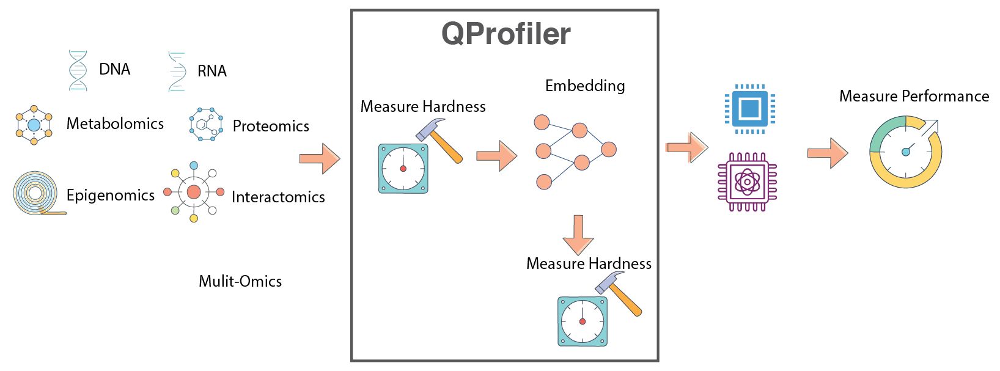
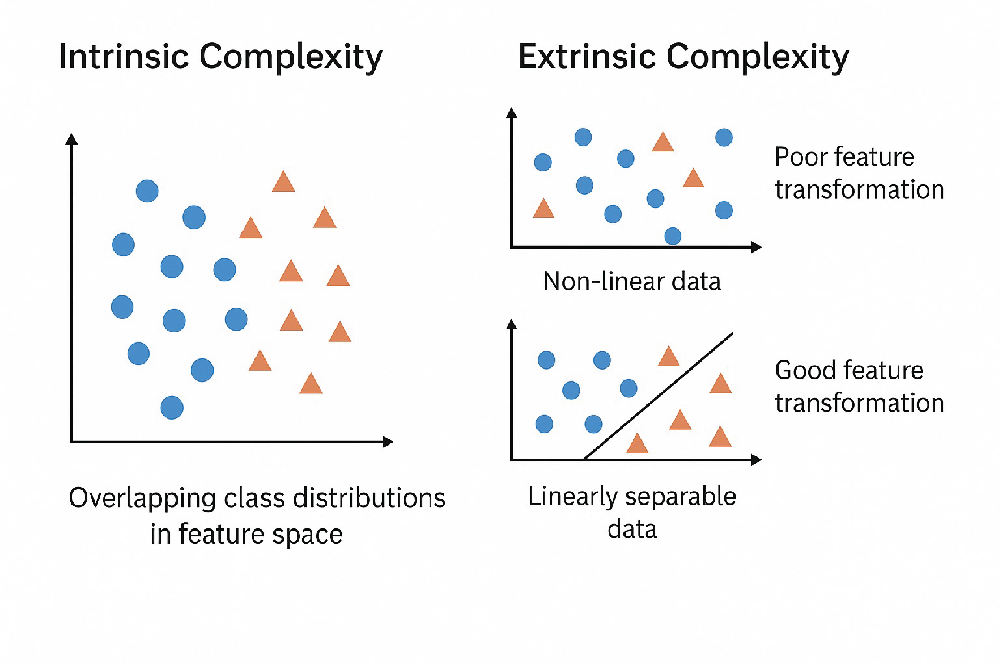

#######################################
QProfiler
#######################################

**Automated ML Benchmarking with Data Complexity Analysis**

QProfiler is a comprehensive tool that goes beyond simple model evaluation. It provides:

🔬 **Dual Analysis Approach**
   - **Model Performance**: Benchmarks both classical and quantum machine learning models
   - **Data Complexity**: Computes intrinsic dataset characteristics to understand model behavior

📊 **What QProfiler Does**
   1. **Runs Multiple Models**: Evaluates classical (RF, SVM, LR, etc.) and quantum (QSVC, PQK, VQC) algorithms
   2. **Analyzes Data Complexity**: Computes 15+ complexity measures before model training
   3. **Correlates Results**: Links model performance to data characteristics
   4. **Automates Workflows**: Handles data splitting, scaling, encoding, and evaluation

   
   QProfiler workflow: Automated benchmarking pipeline combining data complexity analysis with model performance evaluation.

.. important::
    **Key Feature**: QProfiler computes data complexity metrics *before* running models, providing insights into why certain models perform better on specific datasets. This helps identify which quantum or classical approaches are most suitable for your data.

.. note::
    Before you start, make sure that you have installed QBioCode correctly by following the  `Installation <https://ibm.github.io/QBioCode/installation.html>`_ guide.

Usage
=====

QProfiler can be used in two ways: as a **command-line tool** or as a **Python library** in your scripts and notebooks.

Command-Line Interface
----------------------

After installing QBioCode with the apps extras (``pip install qbiocode[apps]``), you can run QProfiler from the command line:

**Single Dataset Mode**

.. code-block:: bash

   qprofiler --config-name=config.yaml

This runs QProfiler with the specified configuration file. See :doc:`Configuration Guide <config>` for details on setting up your config file.

**Batch Mode**

For processing multiple datasets in parallel:

.. code-block:: bash

   qprofiler-batch

This will process all CSV files in the configured input directory and generate combined results.

**Configuration File**

QProfiler uses Hydra for configuration management. Create a ``config.yaml`` file in your ``configs/`` directory:

.. code-block:: yaml

   # Example config.yaml
   file_dataset: "my_dataset.csv"
   output_dir: "results/"
   models:
     - rf
     - svc
     - qsvc
   embeddings:
     - none
     - pca

See the :doc:`full configuration guide <config>` for all available options.

Python Library Usage
--------------------

You can also import and use QProfiler components directly in Python:

.. code-block:: python

   from qbiocode import model_run, evaluate
   from qbiocode import scaler_fn, feature_encoding
   import pandas as pd
   
   # Load your data
   data = pd.read_csv('dataset.csv')
   X = data.drop('target', axis=1)
   y = data['target']
   
   # Evaluate data complexity
   complexity_metrics = evaluate(X, y, 'my_dataset')
   
   # Run a specific model
   results = model_run(
       X_train, X_test, y_train, y_test,
       model_type='rf',
       dataset_name='my_dataset'
   )

For complete examples, see the :doc:`QProfiler Tutorial <../tutorials/QProfiler/example_qprofiler>`.

Data Complexity Measures
=========================

In data mining and machine learning, we can distinguish between two fundamental types of complexity that affect model performance:

**Intrinsic Complexity**
   Inherent structure of the data that makes it difficult to learn, independent of the algorithm:
   
   - **Class distribution**: Imbalanced or overlapping classes
   - **Non-linear decision boundaries**: Complex separating surfaces
   - **Higher-order correlations**: Interactions between multiple features
   - **Noise**: Random variations in the data

**Extrinsic Complexity**
   Complexity arising from external factors dependent on the algorithm or preprocessing:
   
   - **Preprocessing issues**: Inadequate feature scaling or transformation
   - **Misalignment between model and data**: Model assumptions don't match data structure
   - **Learning limitations of models**: Insufficient capacity or inappropriate inductive bias

   
   Intrinsic vs. Extrinsic Complexity: Understanding the sources of learning difficulty in machine learning tasks.

QProfiler automatically computes the following complexity measures for each dataset to characterize its intrinsic properties and predict model performance.

Dimensionality Metrics
----------------------

**Number of Features, Samples, and Feature-to-Sample Ratio**
   Basic dataset dimensions that characterize the problem scale. High feature-to-sample ratios (:math:`p/n > 1`) indicate high-dimensional problems prone to overfitting, known as the "curse of dimensionality."
   
   .. math::
      
      \text{Ratio} = \frac{p}{n}
   
   where :math:`p` = number of features, :math:`n` = number of samples.
   
   *Reference:* Bellman, R. (1961). *Adaptive Control Processes*. Princeton University Press.

**Intrinsic Dimension**
   Estimates the true dimensionality of data embedded in high-dimensional space. While data may have :math:`p` features, it often lies on a lower-dimensional manifold of dimension :math:`d \ll p`. Lower intrinsic dimension suggests the data structure is simpler than the ambient dimension implies.
   
   .. math::
      
      d_{\text{intrinsic}} \ll p
   
   *Reference:* Fukunaga, K., & Olsen, D. R. (1971). "An algorithm for finding intrinsic dimensionality of data." *IEEE Transactions on Computers*, C-20(2), 176-183.

**Fractal Dimension**
   Measures self-similarity and geometric complexity of data structure. Values range from 1 (simple line) to 2 (space-filling), indicating varying degrees of complexity and irregularity in the data manifold.
   
   .. math::
      
      D_f = \lim_{\epsilon \to 0} \frac{\log N(\epsilon)}{\log(1/\epsilon)}
   
   where :math:`N(\epsilon)` is the number of boxes of size :math:`\epsilon` needed to cover the data.
   
   .. figure:: ../_static/Sierpinski_triangle.png
      :align: center
      :width: 40%
      
      Sierpinski Triangle: A classic example of a fractal with self-similar structure at multiple scales, illustrating the concept of fractal dimension.
   
   *Reference:* Higuchi, T. (1988). "Approach to an irregular time series on the basis of the fractal theory." *Physica D: Nonlinear Phenomena*, 31(2), 277-283.

Statistical Properties
----------------------

**Variance**
   Measures data spread across features. Low variance features (:math:`\sigma^2 \approx 0`) may not contribute to discrimination; high variance may indicate noise or important signal variation.
   
   .. math::
      
      \sigma^2 = \frac{1}{n}\sum_{i=1}^{n}(x_i - \mu)^2

**Coefficient of Variation (CV)**
   Normalized measure of dispersion that enables comparison across features with different scales. Expressed as percentage of the mean.
   
   .. math::
      
      CV = \frac{\sigma}{\mu} \times 100\%
   
   *Reference:* Abdi, H. (2010). "Coefficient of variation." *Encyclopedia of Research Design*, 1, 169-171.

**Skewness**
   Third statistical moment measuring distribution asymmetry. Negative skewness indicates left-tailed distributions, zero indicates symmetry (normal distribution), and positive skewness indicates right-tailed distributions.
   
   .. math::
      
      \text{Skewness} = \frac{E[(X-\mu)^3]}{\sigma^3}
   
   .. figure:: ../_static/skew.png
      :align: center
      :width: 70%
      
      Distribution skewness: negative skew (left-tailed), zero skew (symmetric), and positive skew (right-tailed). Skewness quantifies the asymmetry of probability distributions.

**Kurtosis**
   Fourth statistical moment measuring tail heaviness and peakedness of distributions. Higher kurtosis indicates heavier tails and more outliers; lower kurtosis indicates lighter tails. Normal distribution has kurtosis of 3 (excess kurtosis of 0).
   
   .. math::
      
      \text{Kurtosis} = \frac{E[(X-\mu)^4]}{\sigma^4}
   
   .. figure:: ../_static/kurt.jpg
      :align: center
      :width: 70%
      
      Distribution kurtosis: platykurtic (light tails, kurtosis < 3), mesokurtic (normal, kurtosis = 3), and leptokurtic (heavy tails, kurtosis > 3). Kurtosis quantifies tail behavior and outlier propensity.
   
   *Reference:* Joanes, D. N., & Gill, C. A. (1998). "Comparing measures of sample skewness and kurtosis." *Journal of the Royal Statistical Society: Series D*, 47(1), 183-189.

**Nonzero Value Count**
   Measures data sparsity. High sparsity (many zeros) indicates sparse representations that may benefit from specialized algorithms or dimensionality reduction.

**Low Variance Feature Count**
   Number of features below the 25th percentile of variance distribution. Identifies potentially uninformative features that contribute little to model discrimination.

Separability Measures
---------------------

**Fisher Discriminant Ratio (FDR)**
   Quantifies class separability as the ratio of between-class to within-class scatter. Higher values indicate better linear separability. Only defined for binary classification.
   
   .. math::
      
      \text{FDR} = \frac{\text{tr}(\mathbf{S}_B)}{\text{tr}(\mathbf{S}_W)}
   
   where :math:`\mathbf{S}_B` is between-class scatter and :math:`\mathbf{S}_W` is within-class scatter.
   
   *Reference:* Fisher, R. A. (1936). "The use of multiple measurements in taxonomic problems." *Annals of Eugenics*, 7(2), 179-188.

**Mutual Information**
   Measures statistical dependence between features and class labels. Higher values indicate features are more informative for classification. Mutual information can be expressed in terms of entropy:
   
   .. math::
      
      I(X;Y) &= \sum_{x,y} p(x,y) \log\frac{p(x,y)}{p(x)p(y)} \\
      &= H(X) + H(Y) - H(X,Y) \\
      &= H(X) - H(X|Y) \\
      &= H(Y) - H(Y|X)
   
   where :math:`H(X)` and :math:`H(Y)` are the marginal entropies, :math:`H(X,Y)` is the joint entropy, and :math:`H(X|Y)` and :math:`H(Y|X)` are the conditional entropies.
   
   .. figure:: ../_static/MutualInformation.png
      :align: center
      :width: 50%
      
      Relationship between entropy, mutual information, and relative entropy (KL divergence). Mutual information quantifies the reduction in uncertainty about one variable given knowledge of another.
   
   *Reference:* Cover, T. M., & Thomas, J. A. (2006). *Elements of Information Theory*. Wiley-Interscience.

**Total Correlation**
   Sum of absolute correlations between all feature pairs (excluding self-correlation). Indicates feature redundancy and multicollinearity in the dataset.
   
   .. math::
      
      TC = \sum_{i \neq j} |\rho_{ij}|
   
   where :math:`\rho_{ij}` is the correlation between features :math:`i` and :math:`j`.
   
   *Reference:* Watanabe, S. (1960). "Information theoretical analysis of multivariate correlation." *IBM Journal of Research and Development*, 4(1), 66-82.

**Log Kernel Density**
   Mean log-likelihood of data under Gaussian kernel density estimation. Indicates data concentration and distribution smoothness. Higher (less negative) values suggest more concentrated data.
   
   .. math::
      
      \log p(x) = \frac{1}{n}\sum_{i=1}^{n} \log\left(\frac{1}{nh^d}\sum_{j=1}^{n}K\left(\frac{x_i-x_j}{h}\right)\right)
   
   where :math:`K` is the kernel function and :math:`h` is the bandwidth.
   
   .. figure:: ../_static/KernelDensityGaussianAnimation.gif
      :align: center
      :width: 60%
      
      Gaussian kernel density estimation: Animation showing how individual kernels (dashed lines) combine to form the overall density estimate (solid line). The bandwidth parameter controls the smoothness of the estimate.
   
   *Reference:* Silverman, B. W. (1986). *Density Estimation for Statistics and Data Analysis*. Chapman and Hall.

Matrix Properties
-----------------

**Condition Number**
   Ratio of largest to smallest singular value of the data matrix. Measures numerical stability and sensitivity to perturbations. High values (:math:`\kappa > 10^3`) indicate ill-conditioned problems with potential numerical instability.
   
   .. math::
      
      \kappa(\mathbf{X}) = \frac{\sigma_{\max}(\mathbf{X})}{\sigma_{\min}(\mathbf{X})} = \|\mathbf{X}\| \cdot \|\mathbf{X}^{-1}\|
   
   where :math:`\sigma_{\max}` and :math:`\sigma_{\min}` are the largest and smallest singular values.
   
   *Reference:* Golub, G. H., & Van Loan, C. F. (2013). *Matrix Computations* (4th ed.). Johns Hopkins University Press.

.. admonition:: Key References
   :class: tip
   
   - **Comprehensive Overview:** `Data Complexity slides <https://github.com/IBM/QBioCode/blob/Tutorial_ISMB25/ISMB2025/SessionII/DataComplexity/datacomplex.pdf>`_ from ISMB 2025 tutorial
   - **Meta-Learning Context:** Lorena, A. C., et al. (2019). "How Complex is your classification problem? A survey on measuring classification complexity." *ACM Computing Surveys*, 52(5), 1-34.

Configuration
=============

QProfiler uses a YAML configuration file to manage all experimental parameters, ensuring reproducibility and enabling batch processing of multiple datasets and models.

Quick Start
-----------

**Basic Usage:**

.. code-block:: bash

    python qprofiler.py --config-name=config.yaml

**Get Help:**

.. code-block:: bash

    python qprofiler.py --help

Configuration Overview
----------------------

The ``config.yaml`` file controls all aspects of the QProfiler workflow:

.. grid:: 2
   :gutter: 2

   .. grid-item-card:: 📁 Data Configuration
      :class-header: bg-primary text-white

      - Input dataset paths
      - File selection (all or specific)
      - Random seeds for reproducibility

   .. grid-item-card:: ⚛️ Quantum Backend
      :class-header: bg-info text-white

      - Backend selection (simulator/hardware)
      - IBM Quantum credentials
      - Shots and error mitigation

   .. grid-item-card:: 🔄 Preprocessing
      :class-header: bg-success text-white

      - Dimensionality reduction methods
      - Feature scaling options
      - Train/test split ratios

   .. grid-item-card:: 🤖 Model Selection
      :class-header: bg-warning text-dark

      - Classical models (SVC, RF, LR, etc.)
      - Quantum models (QSVC, VQC, PQK)
      - Hyperparameter grids

Key Configuration Sections
---------------------------

**1. Dataset Configuration**

.. code-block:: yaml

    # Process all CSV files in folder
    folder_path: 'test_data/'
    file_dataset: 'ALL'
    
    # Or select specific files
    file_dataset: ['dataset1.csv', 'dataset2.csv']
    
    # Reproducibility seeds
    seed: 42        # Classical algorithms
    q_seed: 42      # Quantum algorithms

**2. Quantum Backend Setup**

.. code-block:: yaml

    # Use simulator
    backend: 'simulator'
    
    # Or use IBM Quantum hardware
    backend: 'ibm_least'  # Least busy device
    shots: 1024
    resil_level: 1        # Error mitigation (1-3)
    
    # IBM credentials
    qiskit_json_path: '~/.qiskit/qiskit-ibm.json'
    name: 'account_qbc'   # Account alias
    ibm_instance: 'hub/group/project'  # Optional

**3. Dimensionality Reduction**

.. code-block:: yaml

    # Apply embeddings
    embeddings: ['pca', 'nmf', 'autoencoder']
    n_components: 3
    
    # No embedding
    embeddings: ['none']

**4. Train/Test Split**

.. code-block:: yaml

    test_size: 0.3           # 70:30 train:test
    stratify: ['y']          # Stratified split
    scaling: ['True']        # Feature scaling

**5. Model Selection**

Available models:

- **Classical:** ``svc``, ``dt``, ``lr``, ``nb``, ``rf``, ``mlp``
- **Quantum:** ``qsvc``, ``vqc``, ``qnn``, ``pqk``

.. code-block:: yaml

    # Run all models
    model: ['svc', 'dt', 'lr', 'nb', 'rf', 'mlp',
            'qsvc', 'vqc', 'qnn', 'pqk']
    
    # Or select specific models
    model: ['rf', 'qsvc', 'pqk']

**6. Hyperparameter Configuration**

Each model can have standard parameters and grid search parameters:

.. code-block:: yaml

    # Standard parameters
    svc_args:
      C: 0.01
      gamma: 0.1
      kernel: 'linear'
    
    # Grid search parameters
    gridsearch_svc_args:
      C: [0.1, 1, 10, 100]
      gamma: [0.001, 0.01, 0.1, 1]
      kernel: ['linear', 'rbf', 'poly', 'sigmoid']

.. important::
    **For quantum models:** Grid search requires generating separate config files for each parameter combination.
    Use the :func:`qbiocode.utils.generate_qml_experiment_configs` utility function:
    
    .. code-block:: python
    
        from qbiocode.utils import generate_qml_experiment_configs
        
        # Generate config files for quantum model hyperparameter tuning
        num_configs, used_files = generate_qml_experiment_configs(
            template_config_path='configs/config.yaml',
            output_dir='configs/qml_gridsearch',
            data_dirs=['data/tutorial_test_data/lower_dim_datasets'],
            qmethods=['qnn', 'vqc', 'qsvc'],
            reps=[1, 2],
            n_components=[5, 10],
            embeddings=['none', 'pca', 'isomap']  # Subset of available: none, pca, lle, isomap, spectral, umap, nmf
        )
        
        print(f"Generated {num_configs} configuration files")
        
        # Then run QProfiler for each generated config
        
    **Running Generated Configs**
    
    After generating config files, you have several options to execute them:
    
    **Option 1: Manual execution** (for small numbers of configs)
    
    .. code-block:: bash
    
        qprofiler --config configs/qml_gridsearch/exp_1.yaml
        qprofiler --config configs/qml_gridsearch/exp_2.yaml
        # ... etc.
    
    **Option 2: Bash loop** (for local execution)
    
    .. code-block:: bash
    
        # Run all configs sequentially
        for i in {1..100}; do
            qprofiler --config configs/qml_gridsearch/exp_${i}.yaml
        done
    
    **Option 3: SLURM array job** (for HPC clusters)
    
    .. code-block:: bash
    
        #!/bin/bash
        #SBATCH --array=1-100%10    # Run 100 jobs, max 10 concurrent
        #SBATCH -c 9                # 9 CPUs per job
        #SBATCH --mem=12000         # 12GB memory
        #SBATCH -p your_partition
        
        qprofiler --config configs/qml_gridsearch/exp_${SLURM_ARRAY_TASK_ID}.yaml
    
    .. tip::
        For large hyperparameter grids (hundreds of configs), use SLURM array jobs on HPC clusters for parallel execution.
        Adjust ``--array`` range to match your number of configs and ``%N`` to control concurrent jobs based on cluster resources.
    
    See :func:`qbiocode.utils.generate_qml_experiment_configs` for full documentation and all available parameters.

Detailed Configuration Reference
---------------------------------

For comprehensive documentation of all configuration parameters, see:

.. toctree::
   :maxdepth: 2
   
   Configure YAML <config.md>

Example Configuration
---------------------

A complete example ``config.yaml`` is available at: `apps/qprofiler/configs/config.yaml <../../../apps/qprofiler/configs/config.yaml>`_

.. tip::
    **Best Practices:**
    
    - Always set random seeds for reproducibility
    - Start with a small subset of models to test configuration
    - Use grid search for classical models, separate configs for quantum models
    - Monitor quantum backend availability before large runs
    - Save configurations with descriptive names for different experiments

Troubleshooting
---------------

**Common Issues:**

- **Missing config file:** Ensure ``config.yaml`` is in the correct directory
- **YAML syntax errors:** Validate YAML format (indentation, colons, quotes)
- **IBM Quantum access:** Verify credentials and instance permissions
- **Memory errors:** Reduce number of parallel jobs (``n_jobs`` parameter)
- **Quantum backend errors:** Check backend availability and queue status

.. note::
    The project will fail if the ``config.yaml`` file is missing, incorrectly formatted, or contains invalid parameter values. Always validate your configuration before running large experiments.

Checkpoint and Restart
======================

When processing large batches of datasets, jobs may be interrupted due to time limits, system failures, or resource constraints. QProfiler provides a checkpoint restart utility to resume processing without recomputing completed datasets.

How It Works
------------

The ``checkpoint_restart`` function scans a previous results directory and identifies which datasets were fully processed by checking for completion marker files (e.g., ``RawDataEvaluation.csv``). You can then filter your dataset list to process only the remaining incomplete datasets.

Basic Usage
-----------

.. code-block:: python

   from qbiocode.utils.dataset_checkpoint import checkpoint_restart
   import os
   
   # Identify completed datasets from previous run
   completed = checkpoint_restart(
       previous_results_dir='./previous_run_results',
       verbose=True
   )
   
   # Get all datasets to process
   all_datasets = [f.replace('.csv', '') for f in os.listdir('./data') 
                   if f.endswith('.csv')]
   
   # Filter to only incomplete datasets
   remaining = [d for d in all_datasets if d not in completed]
   
   print(f"Previously completed: {len(completed)} datasets")
   print(f"Remaining to process: {len(remaining)} datasets")
   
   # Continue processing with remaining datasets
   # (use 'remaining' list in your batch processing loop)

Advanced Usage
--------------

**Custom Settings**

.. code-block:: python

   from qbiocode.utils.dataset_checkpoint import checkpoint_restart
   
   # Custom completion marker and directory naming
   completed = checkpoint_restart(
       previous_results_dir='./results_2024_01_15',
       completion_marker='ModelResults.csv',  # Different marker file
       prefix_length=0,  # No prefix to strip from directory names
       verbose=True
   )

**Integration with Batch Processing**

.. code-block:: python

   import os
   from qbiocode.utils.dataset_checkpoint import checkpoint_restart
   from qbiocode.evaluation import model_run
   
   # Step 1: Check for previous results
   if os.path.exists('./previous_results'):
       completed_datasets = checkpoint_restart(
           previous_results_dir='./previous_results',
           verbose=True
       )
   else:
       completed_datasets = []
   
   # Step 2: Get list of all datasets
   data_dir = './datasets'
   all_datasets = [f.replace('.csv', '') for f in os.listdir(data_dir)
                   if f.endswith('.csv')]
   
   # Step 3: Filter to incomplete datasets
   datasets_to_process = [d for d in all_datasets 
                          if d not in completed_datasets]
   
   # Step 4: Process remaining datasets
   for dataset_name in datasets_to_process:
       print(f"Processing {dataset_name}...")
       # Your QProfiler processing code here
       # ...

Parameters
----------

- ``previous_results_dir`` (str): Path to directory with previous run results
- ``completion_marker`` (str, optional): Filename indicating completion (default: ``'RawDataEvaluation.csv'``)
- ``prefix_length`` (int, optional): Characters to strip from directory names (default: 8 for ``'dataset_'`` prefix)
- ``verbose`` (bool, optional): Print progress information (default: False)

Returns
-------

List of dataset names that were successfully completed in the previous run.

.. tip::
   **Best Practices for Checkpoint Restart:**
   
   - Always use ``verbose=True`` to verify which datasets are being skipped
   - Keep previous results directories until you confirm the new run completed successfully
   - Manually combine CSV results from previous and current runs if needed
   - Consider using unique output directories for each run (e.g., with timestamps)

.. note::
   The checkpoint restart function only checks for the *presence* of the completion marker file, not its contents. Ensure your previous run actually completed successfully for the identified datasets.

.. seealso::
   - :doc:`QProfiler Tutorial <../tutorials/QProfiler/example_qprofiler>` - Complete workflow examples
   - :doc:`Configuration Guide <config>` - Setting up batch processing
   - :py:func:`qbiocode.utils.dataset_checkpoint.checkpoint_restart` - Full API documentation

Utility Functions
=================

QBioCode provides several utility functions that can help with batch processing workflows, configuration management, and file organization.

Finding Duplicate Files
-----------------------

When generating multiple experiment configurations (e.g., via grid search), you may accidentally create duplicate configuration files. The ``find_duplicate_files`` function helps identify these duplicates before running batch jobs.

.. code-block:: python

   from qbiocode.utils.find_duplicates import find_duplicate_files
   
   # Find duplicate YAML configs
   duplicates = find_duplicate_files(
       'configs/qml_gridsearch/',
       file_pattern='.yaml',
       verbose=True
   )
   
   if duplicates:
       print(f"Warning: Found {len(duplicates)} duplicate configuration pairs")
       for file1, file2 in duplicates:
           print(f"  {file1}")
           print(f"  {file2}")
           # Optionally remove one of the duplicates
           # os.remove(file2)

**Use Cases:**

- Validate experiment configurations before batch processing
- Clean up redundant config files from grid search generation
- Identify duplicate datasets in data directories
- Audit configuration consistency across projects

Searching for Strings in Files
-------------------------------

The ``find_string_in_files`` function helps you quickly locate specific parameters or settings across multiple configuration files.

.. code-block:: python

   from qbiocode.utils.find_string import find_string_in_files
   
   # Find all configs using PCA embedding
   results = find_string_in_files(
       'configs/experiments/',
       'embeddings: pca',
       file_pattern='.yaml',
       return_lines=True
   )
   
   print(f"Found in {len(results)} configuration files:")
   for filepath, matches in results.items():
       print(f"\n{filepath}:")
       for line_num, line_content in matches:
           print(f"  Line {line_num}: {line_content.strip()}")

**Use Cases:**

- Find all configs using a specific model or embedding
- Audit parameter settings across experiments
- Locate configurations with specific quantum backend settings
- Validate consistency of hyperparameters

Tracking Job Progress
---------------------

The ``track_progress`` function monitors computational job progress by comparing completed datasets against total input datasets. Unlike ``checkpoint_restart`` (which returns completed dataset names for filtering), ``track_progress`` provides progress statistics and remaining work estimates.

.. code-block:: python

   from qbiocode.utils.combine_evals_results import track_progress
   
   # Monitor progress of current job
   completed, num_done, num_remaining = track_progress(
       input_dataset_dir='data/inputs',
       current_results_dir='results/current_run',
       completion_marker='RawDataEvaluation.csv',
       verbose=True
   )
   
   print(f"\nProgress: {num_done}/{num_done + num_remaining} datasets completed")
   if num_remaining == 0:
       print("Job complete! Ready to combine results.")

**Key Differences from checkpoint_restart:**

- ``checkpoint_restart``: Returns list of completed names → **Use for resuming jobs**
- ``track_progress``: Returns list + progress counts → **Use for monitoring status**

**Use Cases:**

- Monitor progress of long-running batch jobs
- Verify job completion before combining results
- Estimate remaining computation time
- Generate progress reports

Combining Results from Interrupted Jobs
----------------------------------------

When a job is interrupted and resumed, ``combine_results`` merges results from both runs into unified output files.

.. code-block:: python

   from qbiocode.utils.combine_evals_results import combine_results
   
   # Combine results from interrupted and resumed runs
   eval_df, results_df = combine_results(
       prev_results_dir='results/run1_interrupted',
       recent_results_dir='results/run2_resumed',
       verbose=True
   )
   
   print(f"Combined {len(eval_df)} evaluation records")
   print(f"Combined {len(results_df)} result records")

**Customizing File Patterns:**

.. code-block:: python

   # Custom file prefixes and output names
   eval_df, results_df = combine_results(
       prev_results_dir='results/old',
       recent_results_dir='results/new',
       eval_file_prefix='Evaluation',
       results_file_prefix='Results',
       output_eval_file='AllEvaluations.csv',
       output_results_file='AllResults.csv'
   )

**Use Cases:**

- Merge results after job interruption and restart
- Combine results from multiple batch runs
- Consolidate distributed computation results
- Create unified datasets for downstream analysis

Combined Workflow Example
-------------------------

Here's a complete example combining these utilities with QProfiler batch processing:

.. code-block:: python

   import os
   from qbiocode.utils.dataset_checkpoint import checkpoint_restart
   from qbiocode.utils.find_duplicates import find_duplicate_files
   from qbiocode.utils.find_string import find_string_in_files
   
   # Step 1: Check for duplicate configs
   config_dir = "configs/experiments/"
   duplicates = find_duplicate_files(config_dir, file_pattern='.yaml')
   
   if duplicates:
       print(f"Warning: {len(duplicates)} duplicate configs found")
       # Handle duplicates (remove or rename)
   
   # Step 2: Verify all configs use correct settings
   results = find_string_in_files(
       config_dir,
       'n_splits: 5',  # Ensure all use 5-fold CV
       file_pattern='.yaml'
   )
   
   if len(results) != len(os.listdir(config_dir)):
       print("Warning: Not all configs use 5-fold cross-validation")
   
   # Step 3: Check for previous results and resume
   if os.path.exists('./previous_results'):
       completed = checkpoint_restart('./previous_results', verbose=True)
   else:
       completed = []
   
   # Step 4: Process remaining datasets
   all_datasets = [f.replace('.csv', '') for f in os.listdir('./data')
                   if f.endswith('.csv')]
   remaining = [d for d in all_datasets if d not in completed]
   
   print(f"\nReady to process {len(remaining)} datasets")
   # Continue with QProfiler batch processing...

.. seealso::
   - :py:func:`qbiocode.utils.find_duplicates.find_duplicate_files` - Full API documentation
   - :py:func:`qbiocode.utils.find_string.find_string_in_files` - Full API documentation
   - :py:func:`qbiocode.utils.dataset_checkpoint.checkpoint_restart` - Full API documentation
