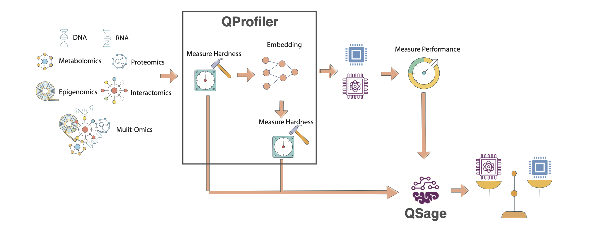

#######################################
QSage
#######################################

**Quantum-Inspired Model Selection Advisor**

QSage is an intelligent meta-learning system that predicts which machine learning models will perform best on your dataset *before* you run them. By learning from data complexity patterns across multiple datasets, QSage provides data-driven model recommendations.

🎯 **What QSage Does**
   - **Learns from History**: Trains on data complexity metrics and model performance from previous experiments
   - **Predicts Performance**: Estimates how well each model will perform on new, unseen datasets
   - **Ranks Models**: Provides confidence-weighted rankings of classical and quantum models
   - **Saves Time**: Helps you focus computational resources on the most promising models

.. important::
    **Key Advantage**: QSage uses the same data complexity measures computed by :doc:`QProfiler <profiler>` to make predictions. This creates a powerful workflow: QProfiler characterizes your data, and QSage recommends the best models based on those characteristics.

.. note::
    Before you start, make sure that you have installed QBioCode correctly by following the  `Installation <https://ibm.github.io/QBioCode/installation.html>`_ guide.

How QSage Works
===============

QSage implements a meta-learning approach using regression models to predict performance metrics:

   **QSage Meta-Learning Pipeline.** The system learns from historical QProfiler data (data complexity metrics and model performance) to predict which models will perform best on new datasets. The pipeline consists of training sub-sages for each model and using them to rank models for new data.

----

.. grid:: 2
   :gutter: 2

   .. grid-item-card:: 📊 Training Phase
      :class-header: bg-primary text-white

      **Input:** Historical data from :doc:`QProfiler <profiler>`
      
      - Data complexity metrics (23 features)
      - Model performance (accuracy, F1, AUC)
      - Multiple datasets and models
      
      **Process:** Train sub-sages for each model
      
      - One predictor per model per metric
      - Random Forest or MLP regressor
      - Cross-validated hyperparameter tuning

   .. grid-item-card:: 🔮 Prediction Phase
      :class-header: bg-success text-white

      **Input:** New dataset complexity metrics
      
      - Same 23 features from :doc:`QProfiler <profiler>`
      - No model training required
      
      **Output:** Performance predictions
      
      - Predicted accuracy/F1/AUC per model
      - Confidence scores (R² values)
      - Ranked model recommendations

The Meta-Learning Pipeline
---------------------------

.. code-block:: text

   Historical Data (QProfiler outputs)
            ↓
   [Data Complexity Features] + [Model Performance]
            ↓
   Train Sub-Sages (one per model)
            ↓
   New Dataset → Extract Complexity → Predict Performance → Rank Models

Data Complexity Features
-------------------------

QSage uses 23 complexity features extracted by :doc:`QProfiler <profiler>`. For detailed descriptions of each metric, see the :ref:`Data Complexity Measures <profiler:Data Complexity Measures>` section in the QProfiler documentation.

**Dimensionality (5 features)**
   - Number of features, samples, feature-to-sample ratio
   - Intrinsic dimension
   - Fractal dimension

**Statistical Properties (10 features)**
   - Variance (mean, std)
   - Coefficient of variation (mean, std)
   - Skewness (mean, std)
   - Kurtosis (mean, std)
   - Nonzero entries
   - Low variance feature count

**Separability (5 features)**
   - Fisher Discriminant Ratio
   - Total correlations
   - Mutual information
   - Mean log kernel density
   - Isomap reconstruction error

**Matrix Properties (2 features)**
   - Condition number
   - Entropy (mean, std)

**Information Theory (1 feature)**
   - Entropy

.. seealso::
   For mathematical formulas, interpretations, and scientific references for each complexity measure, see :doc:`QProfiler Data Complexity Measures <profiler>`.

Usage
=====

QSage can be used in two ways: as a **command-line tool** or as a **Python library** in your scripts and notebooks.

Command-Line Interface
----------------------

After installing QBioCode with the apps extras (``pip install qbiocode[apps]``), you can run QSage from the command line:

**Basic Usage**

.. code-block:: bash

   qsage --input compiled_results.csv --output sage_results/

This trains QSage on historical QProfiler data and generates predictions for all models and metrics.

**Command-Line Options**

.. code-block:: bash

   qsage --input DATA.csv --output DIR/ [OPTIONS]

**Required Arguments:**

- ``--input, -i``: Path to input CSV file containing dataset features and model performance metrics
- ``--output, -o``: Output directory for results and plots

**Optional Arguments:**

- ``--seed, -s``: Random seed for reproducibility (default: 42)
- ``--model-type``: Type of sub-sage model to train: ``rf`` (Random Forest), ``mlp`` (MLP), or ``both`` (default: both)
- ``--test-size``: Proportion of data to use for testing (default: 0.2)

**Examples**

Train with Random Forest only:

.. code-block:: bash

   qsage --input qprofiler_results.csv --output results/ --model-type rf

Train with custom seed and test size:

.. code-block:: bash

   qsage --input data.csv --output results/ --seed 123 --test-size 0.3

Train both Random Forest and MLP:

.. code-block:: bash

   qsage --input data.csv --output results/ --model-type both

**Output Files**

QSage generates:

- ``sage_results.pdf``: Visualization plots for all metrics
- ``sage_summary.csv``: Performance summary table with MAE, MSE, RMSE, and R² scores

**Integration with QProfiler**

QSage is designed to work seamlessly with QProfiler output. The CSV files generated by QProfiler can be used directly as input to QSage:

.. code-block:: bash

   # Step 1: Run QProfiler to generate training data
   qprofiler --config-name=config.yaml
   # This produces: compiled_results.csv and compiled_raw_data_evaluations.csv
   
   # Step 2: Train QSage using QProfiler output
   qsage --input compiled_results.csv --output sage_results/

The ``compiled_results.csv`` file from QProfiler contains:

- All data complexity metrics (23 features)
- Model performance metrics (accuracy, F1, AUC)
- Metadata (dataset names, embeddings, models)

This makes it easy to build a complete workflow:

1. **Profile multiple datasets** with QProfiler
2. **Train QSage** on the profiling results
3. **Predict performance** for new datasets

.. tip::
   **Recommended Workflow:**
   
   Run QProfiler on 20-30 diverse datasets to build a robust training set for QSage. The more varied your training data, the better QSage's predictions will be on new datasets.

- Individual metric plots: ``sage_results_[metric]_barplot.pdf`` and ``sage_results_[metric]_scatterplot.pdf``

Python Library Usage
--------------------

Using QSage
===========

Quick Start
-----------

.. code-block:: python

   from qbiocode import QuantumSage
   import pandas as pd
   
   # Load historical data from QProfiler
   historical_data = pd.read_csv('qprofiler_results.csv')
   
   # Initialize QSage
   sage = QuantumSage(historical_data)
   
   # Train sub-sages for each model
   sage.train_sub_sages(test_size=0.2, sage_type='random_forest')
   
   # Predict on new dataset
   new_data_complexity = pd.read_csv('new_dataset_complexity.csv')
   predictions = sage.predict(new_data_complexity, metric='f1_score')
   
   print(predictions)

Workflow Integration
--------------------

QSage works seamlessly with :doc:`QProfiler <profiler>` to create an end-to-end model selection pipeline.

**Step 1: Generate Training Data with QProfiler**

.. code-block:: bash

   # Run QProfiler on multiple datasets
   python qprofiler.py --config-name=config.yaml

This produces:
   - ``compiled_results.csv`` - Model performance metrics
   - ``compiled_raw_data_evaluations.csv`` - Data complexity metrics

See :doc:`QProfiler documentation <profiler>` for configuration details.

**Step 2: Train QSage**

.. code-block:: python

   # Combine QProfiler outputs
   data = pd.merge(complexity_metrics, performance_metrics, on='Dataset')
   
   # Initialize and train
   sage = QuantumSage(data)
   sage.train_sub_sages(sage_type='random_forest')

**Step 3: Predict for New Dataset**

.. code-block:: python

   # Extract complexity from new dataset using QProfiler's evaluate function
   from qbiocode import evaluate
   new_complexity = evaluate(new_dataset, labels, 'new_data')
   
   # Get predictions
   predictions = sage.predict(new_complexity, metric='f1_score')

Configuration Options
---------------------

**Training Parameters**

.. code-block:: python

   sage.train_sub_sages(
       test_size=0.2,           # Train/test split ratio
       sage_type='random_forest' # 'random_forest' or 'mlp'
   )

**Prediction Parameters**

.. code-block:: python

   predictions = sage.predict(
       input_data,              # DataFrame with complexity features
       metric='f1_score'        # 'accuracy', 'f1_score', or 'auc'
   )

**Available Models**

QSage can predict performance for:

- **Classical:** SVC, Decision Tree, Logistic Regression, Naive Bayes, Random Forest, MLP
- **Quantum:** QSVC, VQC, QNN, PQK

Understanding Predictions
-------------------------

QSage returns a DataFrame with:

.. code-block:: text

   model    | f1_score | r2    | f1_score*r2
   ---------|----------|-------|-------------
   rf       | 0.92     | 0.85  | 0.782
   qsvc     | 0.88     | 0.78  | 0.686
   svc      | 0.85     | 0.82  | 0.697
   ...

**Columns:**
   - ``model``: Model name
   - ``[metric]``: Predicted performance
   - ``r2``: Prediction confidence (R² score from training)
   - ``[metric]*r2``: Confidence-weighted score (used for ranking)

.. tip::
   **Interpreting Results:**
   
   - Higher ``[metric]*r2`` = Better expected performance with higher confidence
   - High ``r2`` (>0.7) = Reliable prediction
   - Low ``r2`` (<0.5) = Uncertain prediction, consider running the model anyway
   - Top-ranked models are your best bets for the new dataset

Tutorial and Examples
=====================

For a complete walkthrough with visualizations and analysis, see the interactive tutorial:

.. toctree::
   :maxdepth: 1
   
   QSage Tutorial Notebook <https://github.com/IBM/QBioCode/blob/main/tutorial/QSage/qsage.ipynb>

The tutorial covers:
   - Loading and preparing QProfiler data
   - Training QSage with different configurations
   - Making predictions and interpreting results
   - Visualizing prediction accuracy
   - Comparing predicted vs actual performance

Best Practices
==============

**Training Data Quality**

- Use diverse datasets (different sizes, complexities, domains)
- Include at least 20-30 datasets for robust training
- Ensure QProfiler was run with consistent settings
- Include both classical and quantum model results

**Model Selection**

- **Random Forest** (default): Better for non-linear relationships, more robust
- **MLP**: Can capture complex patterns, requires more data

**Prediction Confidence**

- Trust predictions with R² > 0.7
- Be cautious with R² < 0.5
- Consider running top 3-5 models even if predictions vary

**Iterative Improvement**

- Add new datasets to training data over time
- Retrain QSage periodically with updated results
- Track prediction accuracy to validate QSage performance

Limitations and Considerations
===============================

.. warning::
   **Important Limitations:**
   
   - QSage predictions are only as good as the training data
   - Performance on datasets very different from training data may be unreliable
   - Quantum model predictions require quantum model training data
   - Does not account for model-specific hyperparameter tuning

**When to Use QSage:**

✅ You have historical QProfiler results from multiple datasets
✅ You want to prioritize which models to try first
✅ Computational resources are limited
✅ You need quick model selection guidance

**When to Run All Models:**

❌ First time analyzing a new data domain
❌ Dataset characteristics are very different from training data
❌ You have sufficient computational resources
❌ You need definitive performance comparisons

Technical Details
=================

**Sub-Sage Architecture**

For each model :math:`M` and metric :math:`m`:

.. math::

   \hat{y}_{M,m} = f_{\theta}(\mathbf{x}_{\text{complexity}})

where:
   - :math:`\mathbf{x}_{\text{complexity}}` = 23-dimensional complexity feature vector
   - :math:`f_{\theta}` = Random Forest or MLP regressor
   - :math:`\hat{y}_{M,m}` = Predicted performance metric

**Confidence-Weighted Ranking**

Models are ranked by:

.. math::

   \text{Score}_M = \hat{y}_{M,m} \times R^2_M

where :math:`R^2_M` is the prediction confidence from cross-validation.

**Feature Importance**

QSage can reveal which complexity features are most predictive of model performance, helping understand *why* certain models work better on specific data types.

.. admonition:: Reference
   :class: tip
   
   For implementation details, see ``apps/sage/sage.py`` in the QBioCode repository.